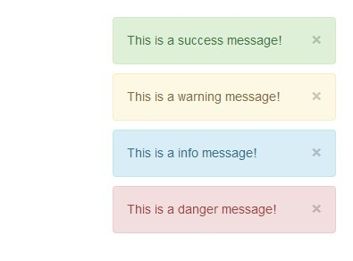

# Bootstrap Notify


Installation
--------

```bash
"sankaest/yii2-notification": "*",
"bower-asset/remarkable-bootstrap-notify": "^3.1",
```

to the ```require``` section of your `composer.json` file.


Usage
-----

```php
use sankaest\modules\notification\Wrapper;

echo Wrapper::widget([
    'layerClass' => 'sankaest\modules\notification\layers\BootstrapNotify',
    // default options
    'options' => [
        'newest_on_top' => false,
        'showProgressbar' => true,
        'placement' => [
            'from' => 'top',
            'align' => 'right'
        ]

        // and more for this library here https://github.com/mouse0270/bootstrap-notify
    ],
]);

```
