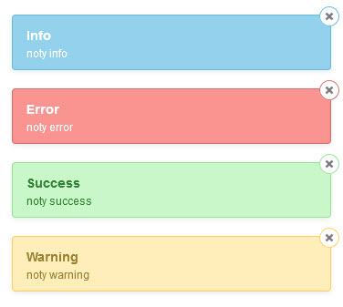

# JqueryNotify


Installation
--------

```bash
"sankaest/yii2-notification": "*",
"bower-asset/jquery.notify": "^1.0"
```

to the ```require``` section of your `composer.json` file.


Usage
-----

```php
use sankaest\modules\notification\Wrapper;

echo Wrapper::widget([
         'layerClass' => 'sankaest\modules\notification\layers\JqueryNotify',
         // default options
         'options' => [
             'theme' => 'default', // or 'dark-theme'
             'position' =>[
                 'x' => 'right',
                 'y' => 'top'
             ],
             'overlay' => false,
             'overflowHide' => false,
             'autoHide' => true,

        // and more for this library here https://github.com/CreativeDream/jquery.notify
    ],
]);

```
