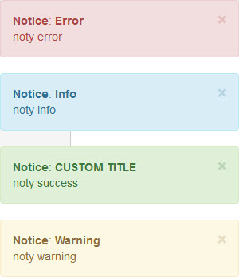

# Jquery Toaster


Installation
--------

```bash
"sankaest/yii2-notification": "*",
"bower-asset/jquery.toaster": "*"
```

to the ```require``` section of your `composer.json` file.


Usage
-----

```php
use sankaest\modules\notification\Wrapper;

echo Wrapper::widget([
         'layerClass' => 'sankaest\modules\notification\layers\JqueryToaster',
         // default options
         'options' => [
            'settings' => [
                'toaster' => [
                    'css' => [
                        'position' => 'fixed',
                        'top' => '10px',
                        'right' => '10px',
                        'width' => '300px',
                        'zIndex' => 50000
                    ],
                ],
                'toast' => [
                    'fade' => 'slow',
                ],
            'timeout' => 3000
            ]

        // and more for this library here https://github.com/scottoffen/jquery.toaster
    ],
]);

```
