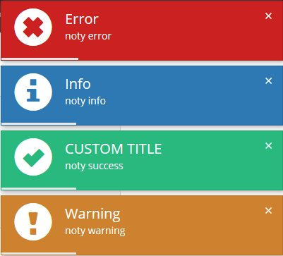

# Lobibox


Installation
--------
```bash
"sankaest/yii2-notification": "*",
"bower-asset/lobibox": "*"
```

to the ```require``` section of your `composer.json` file.

Usage
-----
```php
use sankaest\modules\notification\Wrapper;

echo Wrapper::widget([
    'layerClass' => 'sankaest\modules\notification\layers\Lobibox',
    'layerOptions'=>[
        'soundPath' => false,
        'sound' => false
    ],
    // default options
    'options' => [
        'pauseDelayOnHover' => true,
        'continueDelayOnInactiveTab' => false,
        'delay' => 5000,
        'position' => 'top right',

        // and more for this library here https://github.com/arboshiki/lobibox 
    ],
]);

```
