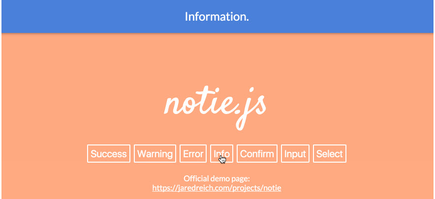

# Notie


Installation
--------

```bash
"sankaest/yii2-notification": "*",
"bower-asset/notie": "^3.2"
```

to the ```require``` section of your `composer.json` file.


Usage
-----

```php
use sankaest\modules\notification\Wrapper;

echo Wrapper::widget([
    'layerClass' => 'sankaest\modules\notification\layers\Notie',
    // default options
    'options' => [
          'colorSuccess' => '#57BF57',
          'colorWarning' => '#D6A14D',
          'colorError' => '#E1715B',
          'colorInfo' => '#4D82D6',
          'colorNeutral' => '#A0A0A0',
          'colorText' => '#FFFFFF',
          'animationDelay' => 300, // Be sure to also change "transition: all 0.3s ease" variable in .scss file
          'backgroundClickDismiss' => true

        // and more for this library...
    ],
]);

```
