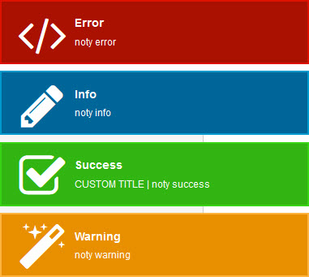

# Notific8


Installation
--------

```bash
"sankaest/yii2-notification": "*",
"bower-asset/notific8": "^3.5"
```

to the ```require``` section of your `composer.json` file.


Usage
-----

```php
use sankaest\modules\notification\Wrapper;

echo Wrapper::widget([
  'layerClass' => 'sankaest\modules\notification\layers\Notific8',
  // default options
  'options' => [
        'life' => 5000,
        'sticky' => false,
        'horizontalEdge' => 'top',
        'verticalEdge' => 'right',
        'family' => 'legacy', // legacy, chicchat, atomic

        // and more for this library https://github.com/ralivue/notific8/wiki/Options
  ],
]);

```
