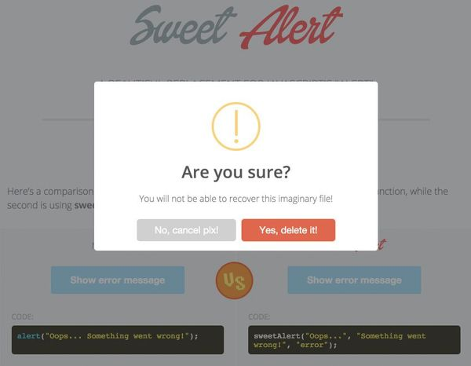

# Sweetalert


Installation
--------

```bash
"sankaest/yii2-notification": "*",
"bower-asset/sweetalert": "^1.1"
# or "bower-asset/bootstrap-sweetalert": "^1.0"
```

to the ```require``` section of your `composer.json` file.


Usage
-----

```php
use sankaest\modules\notification\Wrapper;

echo Wrapper::widget([
    'layerClass' => 'sankaest\modules\notification\layers\Sweetalert',
    // or 'sankaest\modules\notification\layers\SweetalertBootstrap'
    'layerOptions' => [
        'theme' => 'facebook', // facebook, google, twitter
    ],
    // default options
    'options' => [
        'showCancelButton' => false,
        'closeOnConfirm' => false,
        'disableButtonsOnConfirm' => true,
        'html' => false
    ]
]);

```
